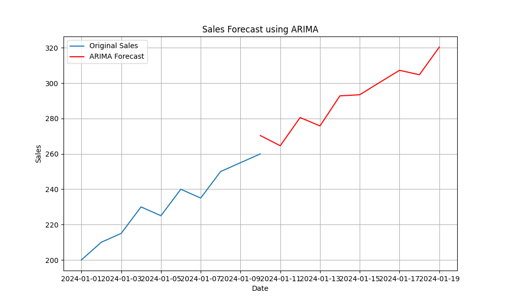
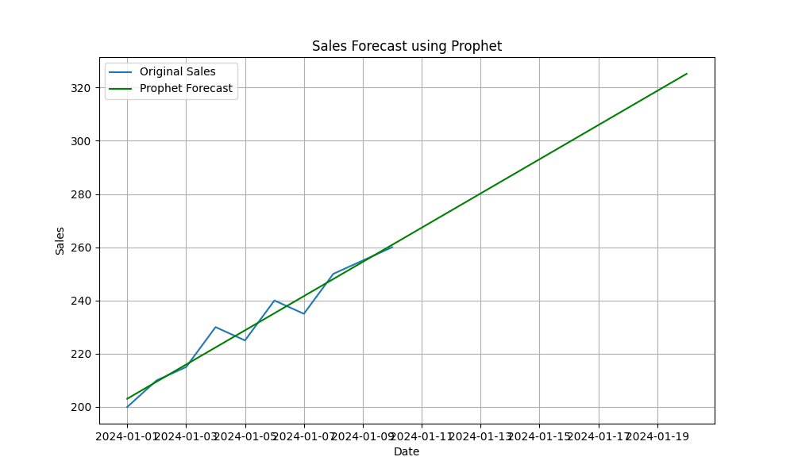

# Time Series Analysis Project

This project demonstrates how to analyze and forecast time series data using ARIMA and Prophet models. The dataset contains daily sales data over a 15-day period. The goal is to predict future sales based on historical data using different forecasting techniques.

### Forecast Results

The following plots were generated as part of the analysis:

1. **ARIMA Forecast**

   

2. **Prophet Forecast**

   


## Data Description

The dataset used for this project is a sample sales dataset saved in `data/sales_data.csv`. It includes daily sales data for a 15-day period. Each row represents a single day's sales.

### Columns

- **Date**: The date of the sales record (in YYYY-MM-DD format).
- **Sales**: The number of sales made on that particular date.

## Project Structure

The repository contains the following files and directories:

- `data/`
  - `sales_data.csv` - The CSV file containing the sample sales data.

- `images/`
  - `arima_forecast.png` - Plot of the sales forecast using the ARIMA model.
  - `prophet_forecast.png` - Plot of the sales forecast using the Prophet model.

- `time_series_analysis.py` - The main Python script for performing time series analysis and generating forecasts.

- `README.md` - This file, providing an overview of the project and instructions.

### How to Run

1. **Clone the repository:**

    ```bash
    git clone https://github.com/yourusername/time-series-analysis.git
    cd time-series-analysis
    ```

2. **Create and activate a virtual environment (optional but recommended):**

    ```bash
    python -m venv env
    source env/bin/activate  # On Windows, use `env\Scripts\activate`
    ```

3. **Install the dependencies:**

    ```bash
    pip install pandas matplotlib statsmodels prophet
    ```

4. **Run the analysis:**

    ```bash
    python time_series_analysis.py
    ```

5. **Check the output:**
   - The processed data will be saved as plots in the `images` folder.


### Sample Data

```csv
Date,Sales
2023-01-01,100
2023-01-02,110
2023-01-03,130
2023-01-04,120
2023-01-05,150
2023-01-06,160
2023-01-07,170
2023-01-08,180
2023-01-09,190
2023-01-10,200
2023-01-11,210
2023-01-12,220
2023-01-13,230
2023-01-14,240
2023-01-15,250
